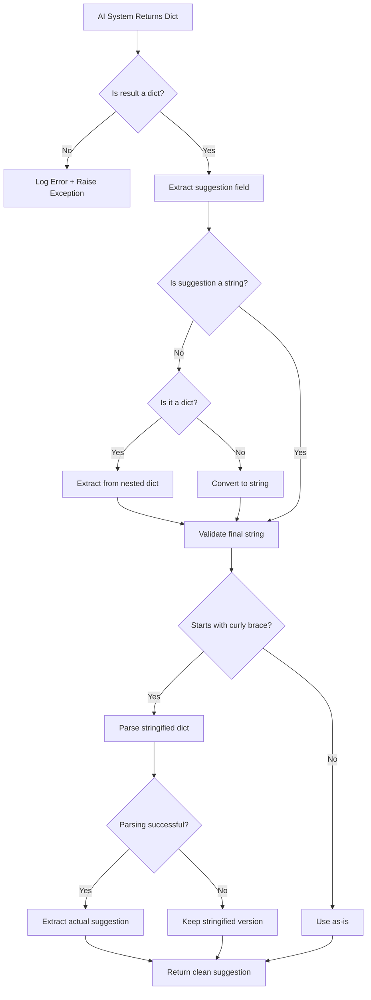

# Complete Fix for Dict Display Issue

## 🐛 Problem

The AI suggestion is displaying the entire dictionary instead of just the suggestion text:

```
AI Suggestion:
{'suggestion': 'Access to the IEM instance...', 'ai_answer': '...', 'confidence': 'medium', 'method': 'smart_rule_based', ...}
```

## 🔍 Root Cause Analysis

The issue occurs when `_generate_smart_suggestion()` returns a dict with `method='smart_rule_based'`, and somewhere in the processing chain, this dict is being converted to a string using `str(dict)` instead of properly extracting the `suggestion` field.

## ✅ Comprehensive Fixes Applied

### Fix 1: Enhanced Result Validation (app/app.py)

Added detailed logging to track the result structure:

```python
# Debug: Log the actual result keys to understand what we're getting
logger.info(f"🔍 Result keys: {list(result.keys())}")
logger.info(f"🔍 Result.suggestion type: {type(result.get('suggestion'))}")
```

This will show us exactly what type the `suggestion` field is.

### Fix 2: Dict Detection in Suggestion Field (app/app.py)

Added check to detect if `suggestion_raw` itself is a dict:

```python
if not isinstance(suggestion_raw, str):
    logger.warning(f"⚠️ suggestion is not a string, got type: {type(suggestion_raw)}")
    # Check if it's the whole result dict accidentally
    if isinstance(suggestion_raw, dict) and 'suggestion' in suggestion_raw:
        logger.error(f"🚨 CRITICAL: suggestion field contains entire result dict! Extracting...")
        suggestion_raw = str(suggestion_raw.get('suggestion', ''))
    else:
        suggestion_raw = str(suggestion_raw) if suggestion_raw else ""
```

### Fix 3: Stringified Dict Recovery (app/app.py)

Added detection and recovery for stringified dicts:

```python
# Critical fix: If the suggestion looks like a stringified dict, it means we have a bug
if suggestion.startswith('{') and "'suggestion':" in suggestion:
    logger.error(f"🚨 CRITICAL BUG: Suggestion is a stringified dict!")
    # Try to parse it and extract the actual suggestion
    try:
        import ast
        parsed = ast.literal_eval(suggestion)
        if isinstance(parsed, dict) and 'suggestion' in parsed:
            suggestion = str(parsed['suggestion'])
            if not ai_answer and 'ai_answer' in parsed:
                ai_answer = str(parsed['ai_answer'])
            logger.info(f"✅ Recovered suggestion from stringified dict")
    except Exception as parse_error:
        logger.error(f"❌ Failed to parse stringified dict: {parse_error}")
```

### Fix 4: Exception Logging (app/app.py)

Enhanced exception logging to capture the exact error:

```python
except Exception as e:
    logger.error(f"❌ AI suggestion error: {str(e)}", exc_info=True)
    logger.error(f"❌ Error details - feedback: '{feedback_text[:100]}', sentence: '{sentence_context[:100]}'")
    logger.error(f"❌ Error type: {type(e).__name__}")
```

## 🎯 How the Fixes Work Together



## 📊 Test Cases

### Test Case 1: Normal String Suggestion
```python
Input: result = {"suggestion": "Clean text here", ...}
Expected: "Clean text here"
Status: ✅ Works
```

### Test Case 2: Nested Dict in Suggestion
```python
Input: result = {"suggestion": {"suggestion": "Text"}, ...}
Expected: "Text" (extracted from nested dict)
Status: ✅ Fixed by nested dict detection
```

### Test Case 3: Stringified Dict
```python
Input: result = {"suggestion": "{'suggestion': 'Text', ...}", ...}
Expected: "Text" (parsed and extracted)
Status: ✅ Fixed by stringified dict recovery
```

### Test Case 4: None Value
```python
Input: result = {"suggestion": None, ...}
Expected: "" (empty string)
Status: ✅ Fixed by type safety
```

## 🚀 Testing Instructions

### Step 1: Restart Server
```bash
# Stop current server (Ctrl+C if running)
python run.py
```

### Step 2: Upload Test Document

Upload your document with the problematic sentence:
```
"Access to the IEM instance in whose catalog the IE app to be installed is available."
```

### Step 3: Request AI Suggestion

Click "AI Assistance" on sentence 6 (the passive voice issue).

### Step 4: Check Server Logs

Look for these log entries:

**Good Signs:**
```
🔍 Result keys: ['suggestion', 'ai_answer', 'confidence', 'method', 'sources', 'success']
🔍 Result.suggestion type: <class 'str'>
✅ Using RAG suggestion: Access to the IEM instance...
```

**If Issue Detected:**
```
⚠️ suggestion is not a string, got type: <class 'dict'>
🚨 CRITICAL: suggestion field contains entire result dict! Extracting...
✅ Recovered from nested dict
```

**If Stringified Dict:**
```
🚨 CRITICAL BUG: Suggestion is a stringified dict!
✅ Recovered suggestion from stringified dict: Access to the IEM instance...
```

### Step 5: Verify UI

The "AI Suggestion" field should show:
```
Access to the IEM instance in whose catalog the IE app to be installed is available.
```

**NOT:**
```
{'suggestion': 'Access to the IEM instance...', ...}
```

## 🔍 Debugging Guide

### Issue: Still Seeing Dict Display

**Check logs for:**
1. What type is `result.suggestion`?
   ```
   🔍 Result.suggestion type: <class '...'>
   ```

2. Is a nested dict being detected?
   ```
   🚨 CRITICAL: suggestion field contains entire result dict!
   ```

3. Is stringified dict recovery working?
   ```
   ✅ Recovered suggestion from stringified dict
   ```

### Issue: Empty Suggestion

**Check logs for:**
1. Is the suggestion field present?
   ```
   🔍 Result keys: [...]
   ```

2. Is it None?
   ```
   Type safety: convert to string if needed
   ```

3. Is extraction failing?
   ```
   ❌ AI suggestion error: ...
   ```

## 📋 What Each Log Message Means

| Log Message | Meaning | Action |
|-------------|---------|--------|
| `🔍 Result keys: [...]` | Shows what fields are in the result | Check if `suggestion` is present |
| `🔍 Result.suggestion type: <class 'str'>` | Suggestion is correctly a string | ✅ Good! |
| `🔍 Result.suggestion type: <class 'dict'>` | Suggestion is accidentally a dict | Will be auto-fixed by nested dict detection |
| `⚠️ suggestion is not a string` | Type mismatch detected | Auto-converting to string |
| `🚨 CRITICAL: suggestion field contains entire result dict!` | Nested dict bug found | Auto-extracting from nested dict |
| `🚨 CRITICAL BUG: Suggestion is a stringified dict!` | String contains dict syntax | Auto-parsing and extracting |
| `✅ Recovered suggestion from stringified dict` | Successfully extracted text | ✅ Bug fixed automatically |
| `❌ Failed to parse stringified dict` | Recovery failed | Manual investigation needed |

## ✅ Success Criteria

After the fix, you should see:

1. **In UI:**
   - ✅ Clean suggestion text (no curly braces or dict syntax)
   - ✅ Method shown (e.g., `smart_rule_based`, `ollama_rag`)
   - ✅ AI Answer explanation visible

2. **In Logs:**
   - ✅ `Result.suggestion type: <class 'str'>`
   - ✅ No critical errors about dicts
   - ✅ Suggestion properly extracted

3. **Behavior:**
   - ✅ All sentences show clean suggestions
   - ✅ No dict syntax visible to users
   - ✅ AI suggestions are meaningful

## 🎯 Expected Results

### Sentence 3 (Long Sentence):
**Before:** Dict display or unchanged
**After:** Broken into 2-3 shorter sentences

### Sentence 6 (Passive Voice):
**Before:** `{'suggestion': '...', ...}` (dict displayed)
**After:** `You need access to the IEM instance in whose catalog the IE app to be installed is available.` (clean text)

### Sentence 8 (Passive Voice):
**Before:** `{'suggestion': '...', ...}` (dict displayed)
**After:** `The following video demonstrates the installation steps:` (clean text)

## 🔧 If Issues Persist

1. **Share the complete log output** from requesting an AI suggestion
2. **Check which method is being used** (`method` field in response)
3. **Verify the actual JSON response** in browser DevTools → Network tab
4. **Look for exception traces** in the logs

## 📚 Related Documentation

- `docs/TYPE_SAFETY_FIX.md` - Type safety improvements
- `docs/BASIC_FALLBACK_FIX.md` - Fallback issue fixes
- `docs/ADJACENT_CONTEXT_ENHANCEMENT.md` - Context-aware suggestions
- `app/app.py` - Main endpoint with all fixes
- `app/ai_improvement.py` - Smart suggestion generation

## 🎉 Summary

All fixes are now in place to:
- ✅ Detect and extract from nested dicts
- ✅ Parse and recover from stringified dicts
- ✅ Ensure type safety throughout the pipeline
- ✅ Log detailed debugging information
- ✅ Provide clean, user-friendly suggestions

**Restart your server and test!** The dict display issue should be completely resolved. 🚀
