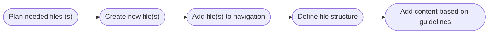

# Quick-start guide to writing documentation for developers

This file gives you an overview of the basics and most important points of writing documentation for software. Each section will also contain a link with additional information if you would like to know more.

## VS Code extensions

Write documentation in VS Code with at least the following extensions:

- [Markdownlint](../../check/quality-measurements/Markdownlint.md#installing-and-using-the-markdownlint-extension-for-vs-code){ .external-link }
- [Code Spell Checker](https://marketplace.visualstudio.com/items?itemName=streetsidesoftware.code-spell-checker){ .external-link }

## Creating new files

!!! info "Working with branches"
    In principle, files should be created/updated on an appropriate branch and merged via a merge request.  
    More information is available [here](../branches/creating-branch.md).

The following process applies when creating a new file:



### Planning needed files

Decide what kind of files and how many files are needed. In principle, there are two types of documentation: step-by-step guides and descriptive/reference documentation. The types of files should not be combined, therefore if you want to describe what a component is and how to use, create one file with a description of the component and another file with how to use it. If you have a lot of content, consider breaking the file down into multiple files based on the following tips:

- **Step-by-step guide**  
Break larger procedures into logical sections. Each file should end with a result and not in the middle of a procedure.
- **Descriptive/reference documentation**  
If a file is long, break descriptions into smaller files based on their topics.

In each case, keep the files together in the navigation.

### Defining filenames

- Lower-case
- ``-`` between words
- Keep the filename short and descriptive

| Good                                                    | Bad                                                       |
|---------------------------------------------------------|-----------------------------------------------------------|
| `developing-custom-app.md`                              | `developing a custom app.md`                              |
| `deleting-configurations.md`                            | `deletingConfigurations.md` / `DeletingConfigurations.md` |
| `configuring-app.md`                                    | `configuration.md`                                        |

!!! info "Further documentation"
    - [Style guide for contributors - Naming conventions for files](./RulesForContributors.md#naming-conventions-for-files){ target="_blank" }
    - [Creating files](../adding-changes/WritingDocumentsInUserDocRepo.md){ target="_blank" }

### Adding files to the navigation

Add new files to the navigation of your documentation as described under [Adding topics to documentation](../adding-changes/WritingDocumentsInUserDocRepo.md#adding-topics-to-documentation).

### Defining file sections

Depending on what type of file you are creating, define the following sections for your file.

=== "Step-by-step guide"

    - **Introduction**  
    What is the file about? Who is it for? What should the reader be able to achieve by following this?
    - **Prerequisites**  
    What is required to follow the steps?
    - **Procedure**  
    Describe what needs to be done step by step. Use headings for larger procedural sections and then describe the steps for the section. Use ordered lists for the actual steps to be performed.
    - **Result**  
    Describe what has been achieved at the end of the procedure. If applicable, describe or link to what can be done next.

=== "Description / Reference documentation"

    - **Introduction**  
    What is the file about? Who is it for? What should the reader know after reading this?
    - **Heading for each description**  
    Add a heading or subheading for each relevant description.
    - **(Optional) Add links to relevant documentation**  
    Add links to further relevant documentation.  
    Add links to how to use or examples of what has been described.

## Updating files

When updating files, create the content as usual based on the [guidelines](#writing-content). Consider [whether additional files](#planning-needed-files) might be needed if you have mixed content or the file is getting long.

## Writing content

### Style guide

- Short sentences
- Friendly but not casual language
- No "please" or "sorry"
- Gender-neutral language
- Prerequisites before the procedure
- Condition before the step
- Direct (you) and not about a user/developer
- Active voice, not passive
- Direct actions instead of "should", "could" etc.
- First word in sentence capitalized and all proper nouns
- No bold text as headings
- Action steps in an ordered list

| Good | Bad |
|---|---|
| When importing an app from an external source, ensure all dependencies are correctly configured. Check that the app is compatible with the existing system architecture. This helps avoid potential integration issues. | When importing an app from an external source, it is crucial to ensure that all dependencies are correctly configured and that the app is compatible with the existing system architecture to avoid potential integration issues. |
| Welcome to this Getting Started guide. | Hey there! |
| them, theirs, salesperson | he, his, hers, salesman |
| <ul><li>Before installing the app, run...</li><li>To run the command, open the terminal and enter...</li></ul> | <ul><li>Run ... before installing the app.</li><li>Open the terminal and enter ... to run the command.</li></ul> |
| You can use the app on System XY. | The user can run the app on System XY. |
| Activate the checkbox "Apply to all users" | The checkbox "Apply to all users" must be activated. /<br>You should activate the checkbox "Apply to all users". |
| For more information, see Siemens Industry Online Support. | For more information, see Siemens industry online support. |

!!! info "Further documentation"
    - [Style guide for contributors - Style](./RulesForContributors.md#style){ target="_blank" }
    - [Style guide for contributors - Tone and voice](./RulesForContributors.md#tone-and-voice){ target="_blank" }
    - [Style guide for contributors - Capitalization](./RulesForContributors.md#use-of-big-and-small-letters-capitalizationcasing){ target="_blank" }
    - [Style guide for contributors - Grammar tenses](./RulesForContributors.md#grammar-tenses){ target="_blank" }
    - [Style guide for contributors - Active voice](./RulesForContributors.md#active-voice){ target="_blank" }
    - [Style guide for contributors - Punctuation](./RulesForContributors.md#minimalist-punctuation){ target="_blank" }
    - [Style guide for contributors - Time-based vocabulary](./RulesForContributors.md#time-based-vocabulary-last-latest-and-recent){ target="_blank" }

### Headings

- As short as possible
- Level 2 and 3 headings as much as possible
- "-ing" headings for descriptions of actions
- Descriptions for all other headings
- First word capitalized and all proper nouns

| Good                           | Bad                                                    |
|--------------------------------|--------------------------------------------------------|
| Adding a new element           | Add a new element                                      |
| Configuration file structure   | Description of the structure of the configuration file |
| Launching the SIMATIC 1234 App | Launch of the SIMATIC 1234 App                         |

!!! info "Further documentation"
    - [Creating headings](../Markdown/BasicSyntaxes.md#headings){ target="_blank" }

### Tables

Use tables for the following:

- Overview/comparison of settings, files, data types, etc.
- Longer descriptions for settings, files, options, etc.
- Overview of fields in a form as part of a step-by-step guide

Guideline for tables:

- Do not use HTML tables. They are harder to read and maintain.
- Keep information short and concise.
- Use HTML to add breaks and lists.

!!! info "Further documentation"
    - [Creating tables](../Markdown/BasicSyntaxes.md#tables){ target="_blank" }

#### Examples

??? example "Overview of data types"

    | Name         | Description  | allowed representations | OMG&nbsp;IDL / implementation |
    | :----------- | :----------- | :---------------------- | :---------------------------- |
    | **Boolean**  | Boolean data type | \[T/t]rue or \[F/f]alse | boolean |
    | **Int8**     | 8 bit signed (tiny) integer | decimal (e.g. 5) | int8 |
    | **UInt8**    | 8 bit unsigned (tiny) integer | decimal (e.g. 5) | uint8 |
    | **Int16**    | 16 bit signed short integer | decimal (e.g. 5) | int16 *or* short |

    ??? example "Markdown code"

        ```markdown
        | Name         | Description  | allowed representations | OMG&nbsp;IDL / implementation |
        | :----------- | :----------- | :---------------------- | :---------------------------- |
        | **Boolean**  | Boolean data type | \[T/t]rue or \[F/f]alse | boolean |
        | **Int8**     | 8 bit signed (tiny) integer | decimal (e.g. 5) | int8 |
        | **UInt8**    | 8 bit unsigned (tiny) integer | decimal (e.g. 5) | uint8 |
        | **Int16**    | 16 bit signed short integer | decimal (e.g. 5) | int16 *or* short |
        ```

??? example "Overview of attributes"

    | Attribute   | Mandatory | Data type | Default  | Description |
    | :---------- | :-------- | :------- | :------- | :---------- |
    | name        | YES       | Ident    |          | System identifier. |
    | domainId    | YES       | Int32    |          | Numeric DDS Domain identifier. |
    | apps        | NO        | App | | List of apps of the system at runtime|
    | description | NO        | String   |          | Descriptive information of the app. |

    ??? example "Markdown code"

        ```markdown
        | Attribute   | Mandatory | Data type | Default  | Description |
        | :---------- | :-------- | :------- | :------- | :---------- |
        | name        | YES       | Ident    |          | System identifier. |
        | domainId    | YES       | Int32    |          | Numeric DDS Domain identifier. |
        | apps        | NO       | App | | List of apps of the system at runtime|
        | description | NO        | String   |          | Descriptive information of the app. |
        ```

??? example "Settings in a step-by-step guide"

    1. Open the project.
    2. To be able to deploy the configuration, update the following in the configuration file:

        | Setting | Entry |
        |---|---|
        | ``iemUrl`` | Enter the URL to your IEM. If you enter the IP address for your IEM, add the port `9443`, e.g. ``https://10.213.131.13121:9443``. |
        | ``computeNodes`` > ``name`` | Define the name of your device as it should be onboarded to your IEM. The name must be unique for your IEM. |
        | ``computeNodes`` > ``type`` | Enter the corresponding device type by selecting the device type from the list. |
        | ``computeNodes`` > ``hostName`` | Remove the comment and enter the IP address of the device. |

    3. Save the configuration.

    ??? example "Markdown code"
        
        ```markdown
        | Setting | Entry |
        |---|---|
        | ``iemUrl`` | Enter the URL to your IEM. If you enter the IP address for your IEM, add the port `9443`, e.g. ``https://10.213.131.13121:9443``. |
        | ``computeNodes`` > ``name`` | Define the name of your device as it should be onboarded to your IEM. The name must be unique for your IEM. |
        | ``computeNodes`` > ``type`` | Enter the corresponding device type by selecting the device type from the list. |
        | ``computeNodes`` > ``hostName`` | Remove the comment and enter the IP address of the device. |
        ```

??? example "Fields in a step-by-step guide"

    1. Click on "Add connection".
    2. Select Connector XY.
    3. Enter the following data in the fields.

        | Field | Entry |
        |---|---|
        | Name | Define a name for the connection. |
        | Type | Select the corresponding type from the drop-down list. |
        | Region | Enter the corresponding acronym for your region:<br><ul><li>North America: ``NA``</li><li>Europe: ``EU``</li></ul> |
        | URL | Enter the URL for the connection. |
        | Username | Enter the username for the connection. |
        | Password | Enter the password for the connection. |

    4. To save the connection, click on "Save".

    ??? example "Markdown code"

        ```markdown
        | Field | Entry |
        |---|---|
        | Name | Define a name for the connection. |
        | Type | Select the corresponding type from the drop-down list. |
        | Region | Enter the corresponding acronym for your region:<br><ul><li>North America: ``NA``</li><li>Europe: ``EU``</li></ul> |
        | URL | Enter the URL for the connection. |
        | Username | Enter the username for the connection. |
        | Password | Enter the password for the connection. |
        ```

??? example "File descriptions"

    The app uses the following configuration files:

    | File | Description |
    |---|---|
    | `pnapp.config.oie.yml` | Contains the app config and references additional files needed by the SDC PNA.<br>You can adjust the path to the referenced files if needed or add settings like enabling simulation, disable watchdog (timeout) of incoming topics etc. |
    | `application.system.oie.yml` | Is referenced by the app config and contains the name, description and domain ID of the whole system that the SDC PNA is part of it. |
    | `pnapp.engineeringTypes.oie.yml` | Defines all middleware tags that are provided or consumed by the SDC PNA.<br>You can edit this file to add or remove middleware tags. |
    | `pnapp.engineering.oie.yml` | Is used to instantiate middleware tags that are defined by the ``pnapp.engineeringTypes.oie.yml`` file - for example if more than one instance of the middleware tag definition should be used.<br>Edit this file to add or remove middleware tags. |

    ??? example "Markdown code"

        ```markdown
        | File | Description |
        |---|---|
        | `pnapp.config.oie.yml` | Contains the app config and references additional files needed by the SDC PNA.<br>You can adjust the path to the referenced files if needed or add settings like enabling simulation, disable watchdog (timeout) of incoming topics etc. |
        | `application.system.oie.yml` | Is referenced by the app config and contains the name, description and domain ID of the whole system that the SDC PNA is part of it. |
        | `pnapp.engineeringTypes.oie.yml` | Defines all middleware tags that are provided or consumed by the SDC PNA.<br>You can edit this file to add or remove middleware tags. |
        | `pnapp.engineering.oie.yml` | Is used to instantiate middleware tags that are defined by the ``pnapp.engineeringTypes.oie.yml`` file - for example if more than one instance of the middleware tag definition should be used.<br>Edit this file to add or remove middleware tags. |
        ```

### Lists

Use lists for the following:

- Ordered list for step-by-step guides
- Unordered list for multiple examples, benefits, etc.

Guideline for lists:

- End full sentences with a period.
- Avoid lists for descriptions of multiple elements. Use a table instead.
- Do not use lists to finish half sentences.
- In step-by-step guides, do not add a heading in bold for each step.
- In step-by-step guides, do not use words like "next", "afterwards", "now", etc.

| Good  | Bad |
|---|---|
| <ol><li>Open the app.</li><li>Click on "Settings".</li><li>Select ``English`` from the "Language" drop-down list.</li></ol> | To start with, open the app. Afterwards, click on "Settings" and then select ``English`` from the "Language" drop-down list.<br><ol><li>**Opening the app**<br>Open the app.</li><li>**Going to the "Settings page"**<br>Click on "Settings".</li><li>**Setting language to "English"**<br>Select ``English`` from the "Language" drop-down list.</li></ol><ol><li>To start with, open the app.</li><li>Afterwards, click on "Settings".</li><li>Then select ``English`` from the "Language" drop-down list.</li></ol> |
| App 1 is compatible with the following apps:<br><ul><li>App 4</li><li>App 5</li><li>App 7</li><li>App 8</li></ul> | App 1 is compatible with App 4, App 5, App 7 and App 8. |
| App 1 can be used for the following:<br><ul><li>Create connections</li><li>Export backups</li><li>Import backups</li></ul> | You can <ul><li>create connections,</li><li>export backups,</li><li>and import backups</li></ul> with App 1. |

!!! info "Further documentation"
    - [Style guide for contributors - Lists](./RulesForContributors.md#lists){ target="_blank" }
    - [Creating lists](../Markdown/BasicSyntaxes.md#list-elements){ target="_blank" }

### Hints/admonitions

Use hints/admonitions for the following:

- Instead of sentences that start with "Note:", "Please note", etc.
- Legal advice like warnings, cautions, dangers
- Additional information that is not essential to the procedure
- Further documentation links

Guideline for hints/admonitions:

- Correct hint type
- Legal advice before procedures
- Not too many hints/admonitions  
Consider if some hints/admonitions could be replaced by a sentence.
- Collapsible hints/admonitions for optional/long code blocks
- Collapsible hints/admonitions for optional additional information

#### Examples

??? example "Legal advice before a procedure"

    !!! info "NOTICE"
        **Risk of data loss**  
        Back up your data before starting the update process to prevent data from being lost.

    1. Go to the "Updates" tab.
    2. Click on "Check for updates".
    3. Click on "Update now" next to the corresponding update.

??? example "Collapsible hint/admonition for code blocks"

    If needed, the full code is available below.

    ??? example "Code example"
    
        ```python
        --8<-- "docs/assets/scripts/copy-remove-headings.py"
        ```

??? example "Additional information"

    1. Open the configuration file.
    2. Add the following data types to the section ``dataTypes``.

        ```yaml
        - name: datatype1
          type: boolean
          defaultValue: 0
        - name: datatype2
          type: int8
          defaultValue: 1
        ```

        !!! info "Data types"
            More information about data types is available in the reference documentation (with link to the corresponding file).

!!! info "Further documentation"
    - [Creating hints/admonitions](../Markdown/Admonitions.md){ target="_blank" }

### UI elements / user interactions

- UI elements in double quotation marks ``"``
- Entries in UI fields, terminal commands, names of parameters/settings in code and filenames in inline code (single or double backticks \`)
- Code that the user should copy or larger blocks of code in code blocks (three backticks \`\`\`)

| Good                                                         | Bad                                      |
|--------------------------------------------------------------|------------------------------------------|
| Click on "OK"                                                | Click on ``OK``                          |
| Enter ``1`` in the "Value" field.                            | Enter "1" in the ``Value`` field.        |
| Change the value of the ``dataType`` setting to ``Boolean``. | Change dataType to Boolean.              |
| Add ``myfile.yml`` to the ``System`` folder.                 | Add "myfile.yml" to the "system" folder. |

!!! info
    - [Using inline code](../Markdown/BasicSyntaxes.md#inline-code){ target="_blank" }
    - [Using code blocks](../Markdown/ExtendedContent.md#code-blocks){ target="_blank" }

### Screenshots

Use screenshots for the following:

- Make the steps in a step-by-step guide clearer.
- Show the result of the action.
- Provide an overview of the app's layout.

Guideline for screenshots:

- Light mode for app UI screenshots
- Red frame (3px border width, <span style="color:#FF0000; font-weight:700;">color #FF0000</span>) to highlight content in the UI
- Dark background (<span style="color:#000028; font-weight:700;">color #000028</span>) for overview graphics
- Blurred internal/private data
- Same project/settings for screenshots that belong together
- Consistent screenshot size for wizards
